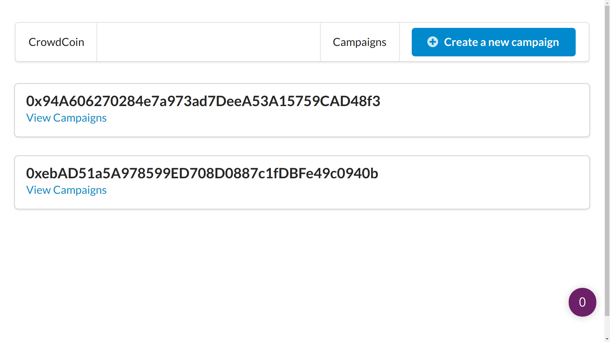

# Kickstarter App
This is the main project in [Ethereum and Solidity: The Complete Developer's Guide](https://www.udemy.com/course/ethereum-and-solidity-the-complete-developers-guide/). 

## Introduction
**Check live deployment at [kickstarter-u](https://kickstarter-u-cdaneamqj-akcgjc007.vercel.app/)**

In the traditional Kickstarter system, a manager proposes a project and asks for funds from the public—people around the world pay this manager directly into a currency. 

After that, the manager is supposed to create the product, as proposed and provide benefits to users. But there is nothing in the world stopping the manager from not doing that and running away with all of the money.

Using the ethereum blockchain network makes it possible to create an application that can solve this trust problem.

The app is supposed to serve as an interaction between managers and the contributors where the manager cannot just run with all of the money and needs permission from contributors on how he/she want to spend the funds.

It empowers the contributors and stops many scammers from doing these scams on a traditional Kickstarter platform.

## Technolgoy used
 - Smart contracts in solidity
 - ganache-cli ethereum RPC client
 - Mocha
 - hdwallet-provider
 - React
 - Semantic UI React
 - Next.js by Vercel

## The Kickstarter app
### Part I: Smart contract development
This part involves the creation of the smart contract itself. Once we come up with a basic smart contract template, we tested the smart contract on Remix IDE and ganache-cli. Remix IDE helps in interacting with the contract in the browser with interacting UI. More extensive tests are done on the ganache-cli RPC network through mocha.
### Part II: Web development using React and Next.js
This part involves the creation of a web application using React and Next.js. While React is used for most of the front end UI and navigation, Next.js is used to routing through different pages and sections in a systematized way. Using Next.js, it becomes easy to handle dynamic URL pages.

## Features
 - Allows multiple campaign creation
 - Allows multiple contributors to contribute
 - <b>Do not allow</b> manager to directly access the funds
 - Allows manager to <u>create multiple spend request</u>
 - Allows contributors to <u>approve requests</u>
 - Allows manager to finalize requests on >50% vote

## Tests on ganache-cli
 - Deploying both `campaign` and `factory` contracts
 - Setting caller as <b>manager</b>
 - Allowing users to send money and marking them as <b>contributors</b>
 - Requires a <b>minimum contribution</b> for becoming a contributor
 - Allowing managers to make a <b>fund request</b>
 - Finalizing by <b>depositing</b> the amount

## How to use
 - Installation
   - `npm i`: installing required packages
 - Compilation and deploying the contract
   - `npm run compile`: compiling the solidity scripts and generating bytecode and ABI
   - `npm run test`: testing smart contract on `ganache-cli` ethereum RPC client
 - Running locally
   - `npm run deploy`: deploying the campaign on a specified network
 - Interacting with a network
   - `node run int`: deploying one campaing instance on a specified network
- Testing
   - `npm run start`: running the application on `localhost:3000/`
 - Contract deployment
  - For deploying contract, update `deploy.js` with your account seedphrase and endpoint

## Screenshots
<h3>Homepage</h3>

<h3>Create new campaign</h3>

<h3>Create new campaign: transaction through metamask</h3>

<h3>Campaign Page</h3>

<h3>Fund request page</h3>

## Contributors
<table><tr><td align="center">
        <a href="https://github.com/akcgjc007">
            
             
            <b>Anupam Kumar</b>
        </a>
    </td></tr>
</table>
